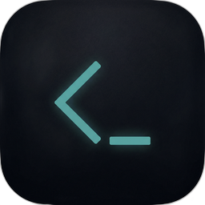
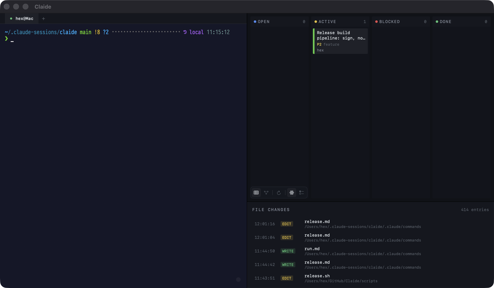

<p align="center">
  
</p>

# Claide

A macOS companion app for [Claude Code](https://docs.anthropic.com/en/docs/claude-code) sessions. Provides a terminal, issue tracker visualization, and live file change monitoring in a single window.

<p align="center">
  
</p>

## Install

```bash
brew tap hex/claide
brew install --cask claide
```

Or download the latest DMG from [GitHub Releases](https://github.com/hex/Claide/releases).

## Requirements

- macOS 14.0+
- [XcodeGen](https://github.com/yonaskolb/XcodeGen)
- [Rust toolchain](https://rustup.rs/) (for the terminal emulation library)
- [beads](https://github.com/hex/beads) (`bd` CLI) for issue tracking

## Build

```
cd Claide
xcodegen generate
xcodebuild -scheme Claide -destination 'platform=macOS' build
```

The Rust library (`claide-terminal`) is built automatically by a Run Script build phase. Or open `Claide.xcodeproj` in Xcode after generating.

## Layout

```
+---------------------------+----------------+
|                           | BOARD | GRAPH  |
|  Terminal                 |----------------|
|  (zsh, full environment)  |  Issue view    |
|                           |  (switchable)  |
|                           |----------------|
|                           |  FILES         |
|                           |  (always on)   |
+---------------------------+----------------+
```

The window is split horizontally: terminal on the left (~65%), sidebar on the right (~35%). The sidebar has two sections:

- **Top**: Board and Graph tabs (switchable)
- **Bottom**: File change log (always visible, ~30% height)

## Features

### Terminal

GPU-accelerated terminal powered by a patched [alacritty_terminal](https://crates.io/crates/alacritty_terminal) (Rust) for VT emulation and Metal for rendering. Launches `/bin/zsh -l` with full environment (homebrew paths, OSC 7 directory tracking). Supports multiple tabs, text selection, custom font selection, and cursor style configuration.

### Board

Kanban-style view with four columns: Open, Active, Blocked, Done. Cards show title, priority, type, owner, and dependency count. Supports two data sources: beads issues (`bd list --json`) and Claude Code tasks (`~/.claude/tasks/`).

### Graph

Interactive force-directed dependency graph rendered on a SwiftUI Canvas. Supports pan, zoom (scroll wheel + trackpad pinch), node dragging, and click-to-select with 2-hop neighbor highlighting. Zoom-adaptive detail: text, badges, and info rows fade in/out at different scale thresholds.

### Files

Live file change monitor. Watches `changes.md` (written by `cs` session hooks on every Claude Write/Edit tool call) using a GCD DispatchSource. Each entry shows timestamp, tool type (Write/Edit), filename, and path.

## Architecture

### Terminal Stack

The terminal is a custom Rust + Metal pipeline:

```
SwiftUI (TerminalPanel) → NSView (MetalTerminalView + CAMetalLayer)
  → Metal shaders (instanced quads for backgrounds + glyphs)
  → GlyphAtlas (Core Text rasterization at Retina resolution)
  → GridRenderer (builds per-cell instance buffers from grid snapshots)
  → TerminalBridge (Swift ↔ Rust C FFI)
  → alacritty_terminal (VTE parser, grid buffer, PTY management)
```

The Rust library (`rust/claide-terminal/`) handles terminal emulation: PTY fork/exec, byte-level VTE parsing, grid state, text selection, and event dispatch. A C ABI exposes 17 functions to Swift covering lifecycle, input, resize, state snapshots, and selection. The Metal renderer takes grid snapshots each frame and draws instanced quads — one pass for cell backgrounds, one for alpha-blended glyph textures.

### View Models

| ViewModel | Drives | Data Source |
|---|---|---|
| `TerminalViewModel` | Terminal status bar, directory tracking | TerminalBridge event callbacks |
| `GraphViewModel` | Board + Graph views, force layout | BeadsService or ClaudeTaskService |
| `FileLogViewModel` | File change list | `changes.md` via FileWatcher |
| `SessionStatusViewModel` | Context usage bar | Claude Code JSONL transcripts |

### Project Structure

```
Claide/
  ClaideApp.swift            # Entry point, window chrome, Sparkle updater
  ContentView.swift          # Root HSplitView + sidebar VSplitView
  Palette.swift              # Color definitions as 8-bit RGB values
  Theme.swift                # Fonts, spacing tokens, tooltips
  FontSelection.swift        # Monospaced font enumeration and creation
  EdgeVisuals.swift          # Graph edge styling (blocks vs parent-child)
  NodeVisuals.swift          # Graph node sizing and border from status
  KanbanColumn.swift         # Issue-to-column assignment by status
  BridgingHeader.h           # Imports Rust C FFI headers
  Updates/
    CheckForUpdatesView.swift  # "Check for Updates..." menu item
  Models/
    Issue.swift              # Shared issue model (beads + claude tasks)
    IssueDependency.swift    # Edge between issues
    FileChange.swift         # Parsed change log entry
    SessionStatus.swift      # Claude Code session context usage
  ViewModels/
    GraphViewModel.swift     # Issues, positions, force layout
    FileLogViewModel.swift   # File watcher + parser
    TerminalViewModel.swift  # Terminal title, directory, process state
    SessionStatusViewModel.swift
  Views/
    Graph/
      GraphPanel.swift       # Canvas-based dependency graph
      IssueNode.swift        # Node appearance reference
    Kanban/KanbanPanel.swift
    FileLog/FileLogPanel.swift
    Terminal/
      MetalTerminalView.swift  # NSView + CAMetalLayer, keyboard input
      TerminalBridge.swift     # Swift wrapper over Rust C FFI
      GlyphAtlas.swift         # Core Text → MTLTexture shelf-packed atlas
      GridRenderer.swift       # Snapshot → Metal instance buffers
      TerminalShaders.metal    # Vertex + fragment shaders
      TerminalPanel.swift      # NSViewRepresentable host
      TerminalTabBar.swift     # Tab strip with add/close
      TerminalTabManager.swift # Tab lifecycle, shell spawning
      TerminalTheme.swift      # Terminal color palette
      SessionStatusBar.swift   # Context usage indicator
    SplitDividerSetter.swift # Initial NSSplitView divider position
    EmptyStateView.swift     # Data-source-aware placeholder
    IssueDetailPopover.swift
    SettingsView.swift       # Font/cursor/appearance settings
  Services/
    BeadsService.swift       # Runs bd CLI, decodes JSON
    ClaudeTaskService.swift  # Reads ~/.claude/tasks/ files
    FileWatcher.swift        # GCD DispatchSource file monitor
  Assets.xcassets/           # App icon
rust/
  build-universal.sh         # Build script (debug/release via CONFIGURATION)
  Cargo.toml                 # Workspace manifest with patched alacritty_terminal
  claide-terminal/
    include/
      claide_terminal.h      # C header declaring FFI types and functions
    src/
      lib.rs               # Crate root
      ffi.rs               # C ABI entry points
      handle.rs            # PTY fork/exec, Term creation
      pty_reader.rs        # Background thread: PTY → VTE parser
      listener.rs          # Event dispatch to Swift callbacks
      grid_snapshot.rs     # Visible grid → C-compatible struct
  patches/                   # Patched alacritty_terminal crate
scripts/
  release.sh               # Signed, notarized DMG build + Sparkle signing
ClaideTests/               # 165 tests across 17 suites
project.yml                # XcodeGen spec
```

## Updates

In-app update checking via [Sparkle](https://sparkle-project.org/). The "Check for Updates..." menu item appears in the Claide menu. Updates are distributed as signed DMGs and verified with EdDSA signatures. The appcast is hosted on GitHub Pages alongside the Homebrew cask.

## Vision

Claide is a personal dashboard for working alongside Claude Code. The terminal is the primary workspace; everything else exists to provide context without switching windows.

Near-term:
- Issue creation and status updates directly from the sidebar
- Drag-and-drop between kanban columns (dispatches `bd update` under the hood)
- Graph edge labels and filtering by dependency type
- Session history: switch between multiple `cs` sessions

Longer-term:
- Watch `bd` output for real-time issue updates (same pattern as FileWatcher)
- Searchable file change log with path filtering

## Tests

```
xcodebuild -scheme Claide -destination 'platform=macOS' test
```

165 tests across 17 suites covering terminal theme, tab management, text selection, palette conversions, session status parsing, issue parsing, force layout convergence, node/edge visuals, kanban column assignment, font selection, file change parsing, Claude Code task parsing, issue detail popovers, and zoom-adaptive metrics.

## License

MIT
